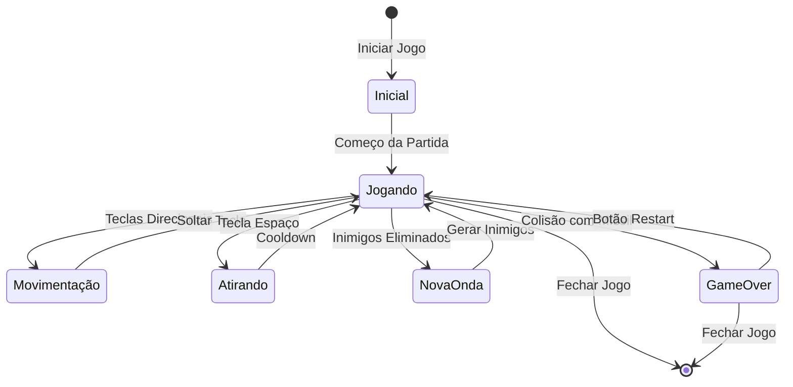

# Space Combat - Documentação do Autômato

## Sumário
1. [Tema e Tipo de Autômato](#1-tema-e-tipo-de-autômato)
2. [Regras do Sistema](#2-regras-do-sistema)
3. [Diagrama do Autômato](#3-diagrama-do-autômato)
4. [Explicação do Autômato](#4-explicação-do-autômato)
5. [Implementação](#5-implementação)

## 1. Tema e Tipo de Autômato
O jogo Space Combat é modelado como um **Autômato Finito Determinístico (AFD)**, pois possui estados bem definidos e transições determinísticas, onde cada ação leva a um único estado possível.

## 2. Regras do Sistema

### Objetivo do Jogo
O jogador controla uma nave espacial e deve sobreviver o máximo tempo possível, destruindo naves inimigas e evitando seus mísseis.

### Regras Principais
1. **Controle da Nave**
   - Setas direcionais ou WASD movem a nave
   - Barra de espaço dispara mísseis

2. **Sistema de Pontuação**
   - Score aumenta com o tempo de sobrevivência
   - Kills aumentam ao destruir naves inimigas

3. **Condições de Game Over**
   - Colisão com míssil inimigo

4. **Sistema de Recordes**
   - Maior pontuação (score) é salva
   - Maior número de kills é salvo

## 3. Diagrama do Autômato

O autômato do jogo possui os seguintes estados e transições:



## 4. Explicação do Autômato

### Estados
1. **Inicial**
   - Estado inicial do jogo
   - Inicialização de variáveis e recursos

2. **Jogando**
   - Estado principal onde ocorre a gameplay
   - Controle da nave
   - Gerenciamento de inimigos
   - Atualização de pontuação

3. **Movimentação**
   - Sub-estado de Jogando
   - Controle da posição da nave
   - Limitação de movimento nas bordas

4. **Atirando**
   - Sub-estado de Jogando
   - Criação de mísseis
   - Controle de cooldown

5. **NovaOnda**
   - Geração de nova onda de inimigos
   - Aumento de dificuldade

6. **GameOver**
   - Exibição de pontuação final
   - Verificação de recordes
   - Opção de reinício

### Transições
- As transições são determinísticas, pois cada entrada (ação do jogador ou evento do jogo) leva a um único estado possível
- Exemplo de código que controla as transições:

```python
# Transição para GameOver
if player_rect.colliderect(enemy_missile_rect):
    game_over = True

# Transição para NovaOnda
if not enemies:
    enemies = generate_wave(
        enemy_ship_images,
        enemy_count,
        min_spacing=2,
        width=50,
        height=50,
        speed_factor=enemy_speed_factor
    )
```

## 5. Implementação

O jogo está implementado em Python usando Pygame. Principais componentes:

### Classes
- `Space_Ship`: Nave do jogador
- `Enemy_Ship`: Naves inimigas
- `Missile`: Sistema de mísseis

### Controle de Estados
```python
# Loop principal que controla os estados
while loop:
    if game_over:
        # Estado GameOver
        draw_game_over()
        draw_score(score)
        draw_restart_button()
    else:
        # Estado Jogando
        player_ship.move(teclas)
        update_missiles()
        update_enemies()
        check_collisions()
```

### Sistema de Pontuação
```python
# Atualização de recordes
if game_over and score > record:
    record = score
    save_record(record, record_kills)
```

### Características Determinísticas
O jogo é determinístico pois:
- Cada ação do jogador tem uma consequência específica
- As transições entre estados são claras e únicas
- O sistema de colisões e pontuação segue regras bem definidas
- Não há elementos aleatórios que afetem as transições entre estados principais

Esta implementação demonstra como um AFD pode modelar efetivamente um jogo de arcade, onde os estados e transições são claramente definidos e determinísticos.

## Como Executar o Jogo

1. Certifique-se de ter Python instalado
2. Instale as dependências:
```bash
pip install pygame
```
3. Execute o jogo:
```bash
python main.py
```

## Controles
- Setas direcionais ou WASD: Movimento da nave
- Barra de espaço: Disparo de mísseis
- ESC: Sair do jogo
